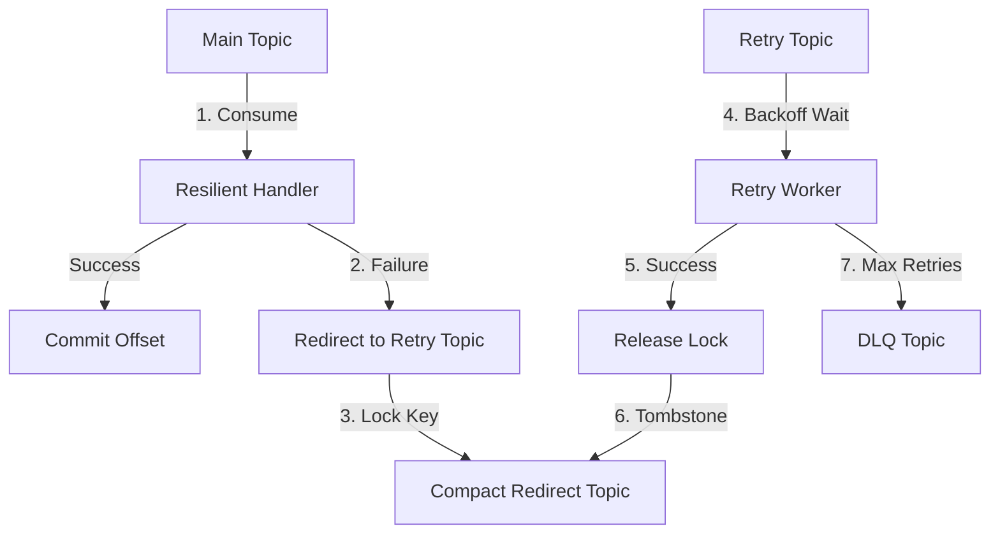

# Kafka Resilience

`kafka-resilience` is a robust Kafka resilience library for Go that implements **non-blocking retries** with **strict ordering guarantees** for messages with the same key.

## Features

-   **Non-Blocking Retries**: Uses a separate "Retry Topic" (Bulkhead Pattern) to avoid stalling the main consumer.
-   **Strict Ordering**: Ensures that messages with the same key are processed in order, even when some messages fail and enter the retry chain.
-   **Distributed Coordination**: Uses a compacted Kafka topic ("Redirect Topic") as a distributed lock state to track failed keys across multiple consumer instances.
-   **Exponential Backoff**: Configurable backoff strategies for retries.
-   **Dead Letter Queue (DLQ)**: Automatically moves messages to a DLQ after maximum retries are exhausted.
-   **Library Agnostic**: Core logic is independent of Kafka clients. Includes a high-quality **Sarama adapter**.
-   **Automatic Topic Management**: Can automatically create and configure Retry, DLQ, and Redirect topics with appropriate settings (e.g., compaction for redirect topics).

---

## Installation

```bash
go get github.com/vmyroslav/kafka-resilience
```

If you are using Sarama, also get the adapter:

```bash
go get github.com/vmyroslav/kafka-resilience/adapter/sarama
```

---

## Quick Start (with Sarama)

```go
package main

import (
	"context"
	"errors"
	"log/slog"
	"github.com/IBM/sarama"
	saramaadapter "github.com/vmyroslav/kafka-resilience/adapter/sarama"
	"github.com/vmyroslav/kafka-resilience/resilience"
)

func main() {
	brokers := []string{"localhost:9092"}
	topic := "orders"
	groupID := "orders-processor"

	// 1. Setup standard Sarama Client
	saramaConfig := sarama.NewConfig()
	saramaConfig.Version = sarama.V4_1_0_0
	client, _ := sarama.NewClient(brokers, saramaConfig)

	// 2. Configure Kafka Resilience
	cfg := resilience.NewDefaultConfig()
	cfg.GroupID = groupID
	cfg.MaxRetries = 5

	// 3. Initialize Tracker with Sarama Adapter
	tracker, _ := saramaadapter.NewResilienceTracker(client, cfg)

	ctx := context.Background()
	handler := &MyOrderHandler{}

	// 4. Start the resilience coordination & retry worker
	tracker.Start(ctx, topic, handler)

	// 5. Wrap your main consumer handler
	consumerFactory := saramaadapter.NewConsumerFactory(client)
	consumer, _ := consumerFactory.NewConsumer(groupID)

	// NewResilientHandler ensures strict ordering by checking if a key is already retrying
	resilientHandler := tracker.NewResilientHandler(handler)
	consumer.Consume(ctx, []string{topic}, resilientHandler)
}

type MyOrderHandler struct{}

func (h *MyOrderHandler) Handle(ctx context.Context, msg resilience.Message) error {
	// Your business logic here
	if err := process(msg.Value()); err != nil {
		return err // Will be automatically retried by Kafka Resilience
	}
	return nil
}
```

---

## Core Concepts

### 1. The Retry Chain
When a message fails in the main consumer, `kafka-resilience` does not block the partition. Instead, it:
1.  **Acquires a Lock**: Records that this message key is now in "Retry Mode" by writing to the **Redirect Topic**.
2.  **Redirects**: Produces the message to a **Retry Topic** with metadata (attempt count, next retry time).
3.  **Acknowledges**: The main consumer continues to the next message.

### 2. Strict Ordering (Key Locking)
If a new message arrives on the **main topic** for a key that is already in the **Retry Topic**, `kafka-resilience` detects the lock and immediately redirects the new message to the end of the Retry Topic. This ensures that `order-1` (failed) is always processed before `order-1` (new), maintaining strict per-key ordering.

### 3. Distributed State (Compact Topics)
The "Redirect Topic" is a Kafka topic with `cleanup.policy=compact`. It stores the current state of which keys are "locked". Because it's a Kafka topic, all instances of your consumer group see the same state, allowing for seamless rebalancing and high availability.

### 4. Backoff & DLQ
Messages in the Retry Topic are only processed when their scheduled `next-retry-time` has passed. If a message exceeds `MaxRetries`, it is moved to the **DLQ Topic**.

---

## Configuration

| Field | Default | Description |
| :--- | :--- | :--- |
| `RetryTopicPrefix` | `"retry"` | Prefix for the retry topic name. |
| `RedirectTopicPrefix` | `"redirect"` | Prefix for the state tracking topic. |
| `DLQTopicPrefix` | `"dlq"` | Prefix for the Dead Letter Queue topic. |
| `MaxRetries` | `5` | Maximum number of retry attempts. |
| `RetryTopicPartitions` | `0` (auto) | Number of partitions for auxiliary topics. 0 means match original topic. |
| `FreeOnDLQ` | `false` | If true, releases the key lock when a message hits DLQ. If false, the key stays "stuck" (manual intervention required) to preserve absolute order. |
| `DisableAutoTopicCreation`| `false` | Set to `true` if your Kafka environment doesn't allow automatic topic creation. |
| `StateRestoreTimeoutMs` | `30000` | Max time to wait for state sync on startup. |

---

## Architecture Diagram



---

## License

[MIT](LICENSE)
